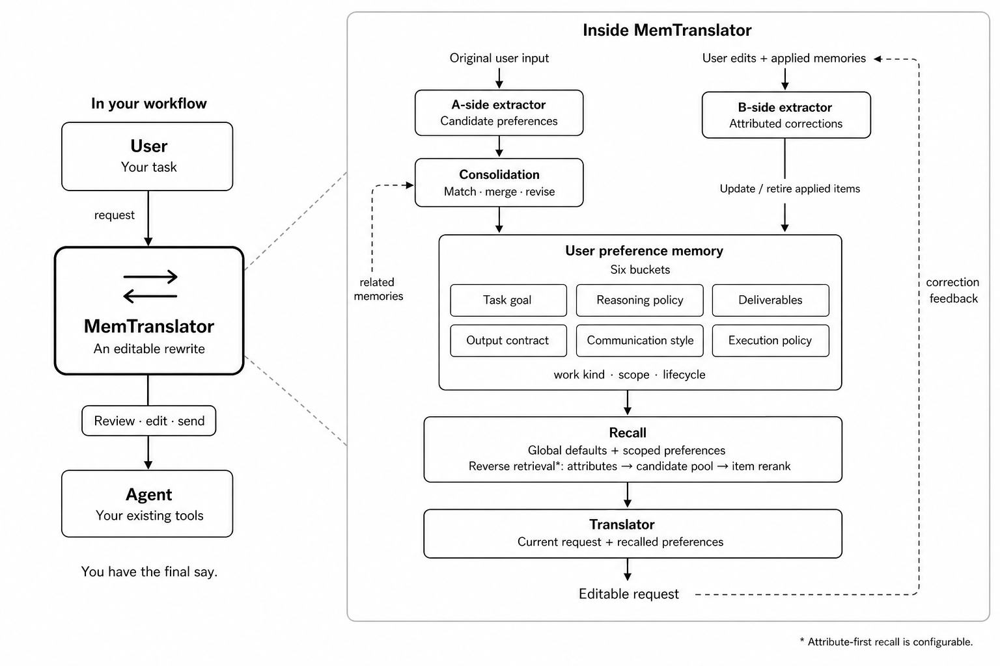

<p align="center">
  
</p>

<h1 align="center">MemTranslator</h1>

<p align="center">
  <strong>English</strong> | <a href="README.zh-CN.md">简体中文</a>
</p>

<p align="center">
  <strong>Learns how you want work done. You decide what gets sent.</strong>
</p>

MemTranslator is a user-side memory layer for how tasks should be executed
and delivered. It learns only from text you explicitly submit with Learn and
from corrections attributed to a prior Write. It then adds the relevant
preferences to the request in your current input box, where you can review,
edit, and send them to the agent you already use.

> **Your working preferences, visible and editable in the request itself.**

## Why MemTranslator

- **Less repetition, less rework.** Automatically identifies and maintains
  your preferences for how tasks should be executed and delivered, based on
  instructions submitted with Learn and attributed corrections. Stop
  repeating the same evidence standards, output formats, and working
  procedures.
- **See memory at work in your input box.** Relevant preferences become
  visible requirements in the request. Read the exact text you will send;
  the agent receives your reviewed request, not a separate memory store or
  a full personal profile.
- **You have the final say, right before sending.** Edit or remove any added
  requirement directly in the current request, without opening settings or
  running the agent first. The request changes immediately; edits to applied
  preferences can also help correct memory through subsequent processing.
- **Your preferences travel with you.** Use one local memory across supported
  desktop and web inputs, including tools such as Codex, Cursor, and ChatGPT.
  Write in place with a hotkey, with no downstream agent SDK integration
  or extra chat interface.

## How it works

<p align="center">
  <video src="assets/memtranslator-demo.mp4" controls width="800">
    <a href="assets/memtranslator-demo.mp4">Watch the MemTranslator demo</a>
  </video>
</p>

| It learns from you | It helps you improve your task prompt |
| --- | --- |
| **A — Repeated or explicit requirements.** From instructions you explicitly submit with Learn, it derives reusable preferences from repeated requirements or explicit rules for future tasks: how to work, what evidence to use, and how to deliver results.<br><br>**B — Corrections after Write.** When Learn follows a Write, the system can learn from your edits to the written result. Feedback can revise or retire only the memory items applied by that Write. | **Writes in your input box.** Press Write to apply the preferences relevant to your current task. The Translator turns them into explicit requirements directly in your task prompt.<br><br>**You decide what gets sent.** See the result, edit or remove any added requirement, then use Learn or the target app's normal send action when you are ready. Write never sends automatically. |

The interaction boundaries are explicit. **Fn+R** starts Write and keeps a
composer-bound Pending Write even if you temporarily focus another input;
there is no periodic content polling. **Fn+Enter** performs Learn and forwards
one ordinary Enter. An unmodified **Enter** keeps the target app's native
behavior and never learns, so users can always send text without adding it to
memory.

## Quickstart

Requires Python 3.12+. The desktop hotkeys run on macOS.
Both installation paths below use `main`. Run `init` only for first-time
configuration; it is not needed again after updating or reinstalling.

### Option 1 — Install the package with pip

In a new directory, create an isolated environment and install the package:

```bash
mkdir -p my-memtranslator
cd my-memtranslator
python3.12 -m venv venv
source venv/bin/activate

python -m pip install --upgrade "git+https://github.com/FFFFFFFANG1/MemTranslator.git@main"
memtranslator init
memtranslator start
```

### Option 2 — Develop from source with uv

```bash
git clone --branch main https://github.com/FFFFFFFANG1/MemTranslator.git
cd MemTranslator
./scripts/dev-sync.sh

uv run --no-sync memtranslator init
uv run --no-sync memtranslator start
```

### Two hotkeys

Focus a supported input box in an allowlisted app or website:

| Shortcut | Action |
| --- | --- |
| **Fn + R** (`Fn+R`) | **Write** — apply remembered preferences to the current input without sending or learning. |
| **Fn + Enter** (`Fn+Enter`) | **Learn** — submit user evidence and forward one ordinary Enter (send in Enter-to-send inputs). No prior Write required. |

See [Design and usage details](docs/design_detail.md) for permissions,
configuration, Learn behavior, demo mode, and development notes.

## Contents

- [Architecture and core mechanisms](#architecture-and-core-mechanisms)
- [Rethinking the memory layer for task-driven agents](#rethinking-the-memory-layer-for-task-driven-agents)
- [Performance comparison](#performance-comparison)
- [Limitations](#limitations)
- [Acknowledgements](#acknowledgements)
- [Design and usage details](docs/design_detail.md)

## Architecture and core mechanisms



Instructions explicitly submitted with Learn and attributed corrections
maintain one preference store. Recall selects preferences for the current
task; the Translator produces a request the user can inspect before sending
to their existing agent. The diagram shows conceptual dependencies, not
synchronous execution.

### Learn, correct, recall, Write

1. **Extractor A — learn from instructions.** Original user text explicitly
   submitted with Learn is buffered for candidate extraction. Each candidate
   retrieves a small set of related memories; consolidation decides whether
   to add, reaffirm, merge, revise, retire, or ignore it.
2. **Extractor B — learn from corrections.** A user edit is paired with
   snapshots of the memories actually applied by that Write. B can update
   or retire those entries, or leave them unchanged; it does not create
   unrelated new memories. An unchanged Write result does not trigger B
   extraction.
3. **Reverse retrieval — applicability first, item text second.** In the
   attribute-first mode, work-kind and scope attributes retrieve a candidate
   pool, then item text is used for reranking. Explicit global requirements
   use a separate budget from scoped recall.
4. **Translator — compile, then let the user decide.** Selected preferences
   become explicit requirements in the current request. Guarded patching and
   write-back checks protect the focused input; the user reviews the result.

A and B buffer independently. Generated Write results are never treated as raw
user evidence for A. “Continual learning” here means maintaining memory
through instructions and feedback, not retraining model weights.

The store uses six controlled buckets: `task_goal`, `reasoning_policy`,
`deliverables`, `output_contract`, `communication_style`, and
`execution_policy`. Items also carry work-kind, scope, and lifecycle
metadata. They are editable requirements, not an opaque user profile.

**Attribute-first recall is currently opt-in.** The default keeps the
text-first baseline. See [Recall configuration](docs/design_detail.md#recall-configuration)
for the switch, budgets, and embedding fallback.

## Rethinking the memory layer for task-driven agents

### From conversational recall to workspace-native memory

A conversational assistant needs continuity across exchanges. A task-driven
agent also needs to inspect artifacts, recover execution state, and decide
what to do next. Once the agent can search and maintain its own workspace,
these needs no longer have to be served by a separate conversation-memory
layer alone.

**Our position is that several memory responsibilities are being internalized
by agents' workspaces and tools, rather than disappearing:**

- **Semantic memory: task and project facts.** Code, documentation, and live
  data can remain the sources of truth. An agent can retrieve them when
  needed instead of relying only on a separately maintained summary.
  [Anthropic's context-engineering account](https://www.anthropic.com/engineering/effective-context-engineering-for-ai-agents)
  describes this shift toward just-in-time retrieval.
- **Episodic memory: conversations and past execution.** When transcripts,
  outcomes, and working notes are retained, the agent can search those
  records to recover relevant history. Recall becomes part of the agent's
  environment, as illustrated by
  [Deep Agents' searchable conversation history](https://docs.langchain.com/oss/python/deepagents/memory#episodic-memory).
- **Procedural memory: reusable task know-how.** Skills and repository-level
  instructions can live alongside the agent's tools and be loaded for the
  task at hand. The agent environment can therefore host this knowledge
  directly; [Deep Agents' file-backed skills](https://docs.langchain.com/oss/python/deepagents/memory#how-memory-works)
  are one concrete example.

This is a shift in responsibility, not evidence that every external memory
system is redundant. It changes the question for an independent, user-side
layer:

> When agents own their workspaces and move from conversations to tasks,
> what should a user-side memory layer still maintain?

### Retrieval does not settle what should carry forward

Longer context windows and workspace search improve access to past
information. They do not, by themselves, determine which instructions remain
binding. A one-off request for a short answer is not necessarily a lasting
preference; a standing preference for concise client emails may later be
revised without changing how research reports should be written.

**The remaining problem is preference maintenance: what should persist,
where should it apply, and which corrections should change it?** Recovering
the original conversation supplies evidence, but applying that evidence
requires decisions about scope, persistence, and supersession. Without a
maintained account of those decisions, users must repeat requirements or
correct the same mismatch when moving between tasks and agents.

### Our position: user-owned procedural preferences

MemTranslator focuses its memory layer on **how the user wants a task to be
executed and delivered**. We call these *procedural preferences*: requirements
about reasoning, evidence, deliverables, format, communication, and execution.
They describe the user's desired way of working, not the agent's general
ability to perform a procedure.

A user's biography can be relevant to some tasks, but need not accompany
every code change or document draft. Conversely, a requirement to report
unrun tests or lead client emails with a decision can matter across many
tasks even when their factual content is unrelated. Such preferences should
be maintained independently of any single conversation, then applied only
within their scope. Current explicit instructions should take precedence.

This motivates a user-side intermediary: instructions and attributed
corrections maintain an editable preference store; the current request
receives the relevant requirements before reaching the agent. The user can
inspect both the stored preferences and their application. The intended
benefit is less repeated specification and rework, without routinely adding
a personal profile or conversation archive to the task context.

### A shared, self-updating AGENTS.md

The practical mental model is an **automatically updated, continually
maintained, shared `AGENTS.md` for working preferences**. Instructions
submitted by Learn and corrections to Write results maintain it over time, while direct
edits keep the user in control. The same local store serves supported agents;
only relevant preferences are compiled into each request.

This is an analogy, not file synchronization: MemTranslator does not create
or modify agents' `AGENTS.md` files. Nor is preference memory unique to this
project: native systems already support
[user-scoped preferences and memory updates](https://docs.langchain.com/oss/python/deepagents/memory#user-scoped-memory).
Our positioning is the combination of a narrow preference boundary,
cross-agent use, continual correction, and user-reviewed application—not a
claim that other agents cannot remember preferences.

## Performance comparison

The [August 26 E1 report](docs/2026-08-26-memtranslator-e1-performance-report.md)
compares native MemTranslator with a Codex file-memory workflow on 12 noisy
episodes, 6,225 historical turns, and 103 scored tasks. E1 evaluates memory
maintenance and preference use in **request rewrites**, not downstream coding
or general task-solving ability.

MemTranslator used native extraction and storage, BGE-M3 retrieval, and a
**DeepSeek V4 Flash** translator. The baseline maintained
`AGENTS.md + MEMORY.md` and used **GPT-5.5 medium** for readout.

| Metric | MemTranslator | Codex file memory |
| --- | ---: | ---: |
| Applicable-memory CARRY, macro | **0.713** | 0.672 |
| Inapplicable-memory SUPPRESS, macro | 0.894 | **0.987** |
| Task-perfect rewrites | **68/103 (66.0%)** | 67/103 (65.0%) |
| Store lifecycle STATE, macro | 0.707 | Not comparable |

In this run, MemTranslator carried five more applicable memories; Codex
suppressed four more negative examples. Task-perfect rewrites differed by
one task. The paired CARRY and SUPPRESS confidence intervals cross zero:
these observations do **not** establish overall superiority or statistical
equivalence.

The result supports the feasibility of a flash-tier intermediary for this
workflow. It is a system-level comparison, not an isolated test of Extractor
B or reverse retrieval. The benchmark's BGE-M3 configuration also differs
from the [default local embedding configuration](docs/design_detail.md#llm-and-embedding-configuration).
See the report for protocol details, uncertainty, and evidence limits.

## Limitations

- **Desktop compatibility.** The hotkey client is macOS-only. Accessibility
  support varies across native, Electron, and browser inputs; uncertain
  targets can result in a no-op or failed read/write. The Fn shortcuts require
  a keyboard that exposes an Fn/Globe modifier; some non-Apple external
  keyboards may not provide one.
- **Learning is fallible and asynchronous.** Extraction and consolidation can
  miss, overgeneralize, or fail to retire a preference. A and B run in batches,
  so a correction is not guaranteed to become an immediate memory update.
- **Learn has a boundary.** Desktop Route A learning requires explicit
  **Fn + Enter** and an allowed source. Write, ordinary Enter,
  focus changes, and elapsed time do not queue raw messages for A.
  Password fields are excluded; this is not continuous recording of inputs.
- **Local-first is not fully offline.** Memory and configuration are stored
  under `~/Library/Application Support/MemTranslator` on macOS. Configured
  LLM calls send relevant text and memory evidence to that endpoint; remote
  embedding mode also sends text to its provider. API keys are stored in a
  local mode-`0600` file and are visible in settings. Keep the Control Center
  local.
- **No memory dump does not mean zero context cost.** Compiled requirements
  still occupy prompt tokens, and relevance selection can be wrong. Write
  latency depends on the model and endpoint.
- **Evidence is limited.** The reported comparison has 12 episode clusters,
  different native system components, and no basis for an end-to-end
  speed/cost ranking. In that run, Codex had higher observed SUPPRESS; neither
  system was perfect.

## Acknowledgements

- [Mem0](https://github.com/mem0ai/mem0) — inspiration for practical,
  continually maintained memory layers.
- [Typeless](https://www.typeless.com/) — inspiration from its in-app
  voice-to-polished-text experience for our hotkey-triggered, in-place Write
  workflow.
