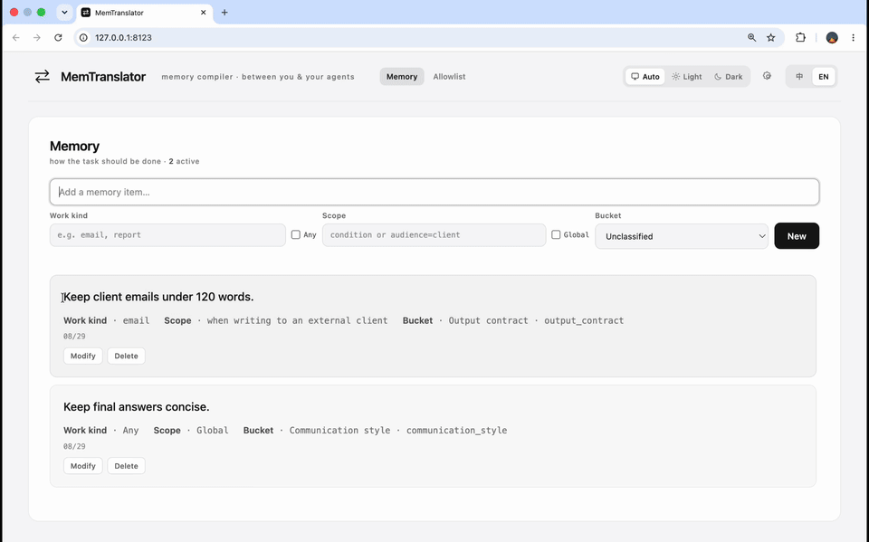

<p align="center">
  
</p>

<h1 align="center">MemTranslator</h1>

<p align="center">
  <a href="README.md">English</a> | <strong>简体中文</strong>
</p>

<p align="center">
  <strong>学习你希望任务如何完成，由你决定最终发送什么。</strong>
</p>

MemTranslator 是一个位于用户侧的记忆层，专注于你对任务执行和交付方式的偏好。
它只从你通过 Learn 主动提交的文本，以及能够归因到先前 Write 的纠正中学习，
再将相关偏好补充到当前输入框中的请求里。你可以检查、修改，然后发送给原本就在使用的 Agent。

> **你的工作偏好，就在请求中看得见、改得了。**

## 为什么选择 MemTranslator

- **少重复，少返工。** 从 Learn 提交的指令和具有明确归因的纠正中，
  自动识别并维护你对任务执行和交付方式的偏好。
  不必反复说明同样的证据标准、输出格式和工作流程。
- **在输入框里，直接看到记忆如何生效。** 相关偏好会成为请求中的明确要求。
  你能看到将要发送的完整文本；Agent 收到的是你检查过的请求，而不是独立的记忆库或完整的个人档案。
- **发送之前，最终决定权始终在你。** 直接在当前请求中修改或删除任何补充要求，
  不必打开设置，也不必先让 Agent 执行任务。请求立即改变；对已应用偏好的修改，
  还可以在后续处理中帮助纠正记忆。
- **换 Agent，偏好也跟着你。** 同一份本地记忆可用于受支持的桌面和网页输入框，
  包括 Codex、Cursor、ChatGPT 等工具。通过 Write 快捷键原位写入，
  无须在下游 Agent 中集成 SDK，也不需要额外的聊天界面。

## 工作方式

<p align="center">
  
</p>

<p align="center">演示会自动循环播放。</p>

| 它从你这里学习 | 它帮你完善任务请求 |
| --- | --- |
| **A — 重复要求或明确要求。** 从你通过 Learn 主动提交的指令中，识别反复出现的要求，或明确适用于未来任务的规则，形成可复用的偏好：如何开展工作、采用什么证据、怎样交付结果。<br><br>**B — Write 之后的纠正。** Learn 跟在 Write 之后时，系统从你对写入结果的编辑中学习。这些反馈只能修改或淘汰本次 Write 实际应用过的记忆条目。 | **直接在输入框中 Write。** 按下 Write，应用与当前任务相关的偏好。Translator 将这些偏好转化为明确要求，直接写入当前任务请求。<br><br>**由你决定最终发送什么。** 查看结果，修改或删除任何补充要求，准备好后使用 Learn 或目标应用原本的发送方式。Write 不会自动发送请求。 |

交互边界是明确的。`Fn+R` 执行 Write，并创建绑定到当前输入框的 Pending Write；
即使短暂切换到其他输入框也不会丢失，客户端不会周期性轮询内容。`Fn+Enter` 执行 Learn，
并转发一次普通 Enter。未加修饰键的普通 **Enter** 始终保留目标应用的原生行为，且绝不学习，
因此用户随时可以发送一条不进入 memory 的消息。

## 快速开始

需要 Python 3.12 或更高版本。桌面快捷键功能运行于 macOS。
以下两种安装方式均使用 `main` 分支。`init` 仅用于首次配置，更新或重新安装后无须再次运行。

### 方式一：使用 pip 安装

在新目录中创建独立环境并安装：

```bash
mkdir -p my-memtranslator
cd my-memtranslator
python3.12 -m venv venv
source venv/bin/activate

python -m pip install --upgrade "git+https://github.com/FFFFFFFANG1/MemTranslator.git@main"
memtranslator init
memtranslator start
```

### 方式二：使用 uv 从源码开发

```bash
git clone --branch main https://github.com/FFFFFFFANG1/MemTranslator.git
cd MemTranslator
./scripts/dev-sync.sh

uv run --no-sync memtranslator init
uv run --no-sync memtranslator start
```

### 两个快捷键

将焦点放在允许列表中的应用或网站内受支持的输入框上：

| 快捷键 | 操作 |
| --- | --- |
| `Fn+R` | **Write** — 将记忆偏好应用到当前输入，不发送，也不学习。 |
| `Fn+Enter` | **Learn** — 提交用户证据，并转发一次普通 Enter（若输入框使用 Enter 发送，则会发送）。无须先 Write。 |

权限、配置、Learn 行为、演示模式和开发说明，见[设计与使用细节](docs/design_detail.zh-CN.md)。

## 目录

- [架构与核心机制](#架构与核心机制)
- [重新思考任务型 Agent 的记忆层](#重新思考任务型-agent-的记忆层)
- [性能对比](#性能对比)
- [局限性](#局限性)
- [致谢](#致谢)
- [设计与使用细节](docs/design_detail.zh-CN.md)

## 架构与核心机制


通过 Learn 主动提交的指令和具有明确归因的纠正，共同维护一份偏好库。
召回过程选出适用于当前任务的偏好，Translator 则生成可供用户检查的请求，再由用户发送给原有 Agent。
图中展示的是概念上的依赖关系，不代表同步执行顺序。

### Learn、纠正、召回、Write

1. **Extractor A — 从指令中学习。** 通过 Learn 主动提交的用户原文进入缓冲区，用于提取候选记忆。
   每条候选会检索少量相关记忆，再由整合过程决定新增、强化、合并、修订、淘汰或忽略。
2. **Extractor B — 从纠正中学习。** 用户的编辑与本次 Write 实际使用的记忆快照配对。
   B 可以更新或淘汰这些条目，也可以保持不变；不会创建无关的新记忆。
   未经修改的 Write 结果不会触发 B 提取。
3. **反向检索 — 先判断适用性，再比较条目文本。** 在属性优先模式下，
   先根据任务类型和作用域属性召回候选池，再根据条目文本重排。
   明确的全局要求使用独立于作用域召回的预算。
4. **Translator — 编译要求，再由用户决定。** 选中的偏好成为当前请求中的明确要求。
   带保护机制的补丁应用与写回检查保护当前聚焦的输入，用户负责检查最终结果。

A 和 B 分别缓冲。系统生成的 Write 结果绝不会作为 A 的用户原始证据。
这里的“持续学习”指通过指令和反馈维护记忆，而不是重新训练模型权重。

偏好库使用六个受控类别：`task_goal`、`reasoning_policy`、`deliverables`、
`output_contract`、`communication_style` 和 `execution_policy`。
条目还包含任务类型、作用域和生命周期元数据。它们是可以编辑的要求，而不是不透明的用户画像。

**属性优先召回目前需要手动启用。** 默认仍使用文本优先的基线方案。
开关、预算和嵌入回退策略，见[召回配置](docs/design_detail.zh-CN.md#召回配置)。

## 重新思考任务型 Agent 的记忆层

### 从对话回忆到工作区原生记忆

对话助手需要在多轮交流间保持连贯。任务型 Agent 还需要检查产物、恢复执行状态，并决定下一步行动。
当 Agent 能够搜索和维护自己的工作区时，这些需求就不必仅由一个独立的对话记忆层来承担。

**我们的判断是：部分记忆职责正在被 Agent 的工作区和工具接管，而不是消失。**

- **语义记忆：任务和项目事实。** 代码、文档和实时数据可以继续作为事实依据。
  Agent 可以按需检索，而不必仅依赖单独维护的摘要。
  [Anthropic 关于上下文工程的说明](https://www.anthropic.com/engineering/effective-context-engineering-for-ai-agents)
  描述了这种向即时检索的转变。
- **情景记忆：对话与过去的执行过程。** 如果保留了对话记录、结果和工作笔记，
  Agent 就能通过搜索这些记录恢复相关历史。回忆能力成为 Agent 环境的一部分，
  例如 [Deep Agents 的可搜索对话历史](https://docs.langchain.com/oss/python/deepagents/memory#episodic-memory)。
- **程序性记忆：可复用的任务方法。** 技能和仓库级指令可以与 Agent 的工具一起存放，
  并根据当前任务加载。因此，Agent 环境可以直接承载这些知识；
  [Deep Agents 基于文件的技能](https://docs.langchain.com/oss/python/deepagents/memory#how-memory-works)
  就是一个具体例子。

这是职责的转移，并不说明所有外部记忆系统都已多余。
对于独立的用户侧记忆层，问题也随之改变：

> 当 Agent 拥有自己的工作区，并从对话走向任务时，用户侧的记忆层还应该维护什么？

### 能检索到历史，不代表知道哪些要求应该延续

更长的上下文窗口和工作区搜索，让历史信息更容易被找到。
但它们本身不能判断哪些指令仍然有效。一次“简短回答”的要求，未必是长期偏好；
“客户邮件保持简洁”这一常用偏好，之后也可能被修改，但不影响研究报告的写法。

**仍需解决的是偏好维护：哪些要求应该保留、适用于哪里、哪些纠正应该改变它们？**
找回原始对话可以提供证据，但应用这些证据，还需要决定作用域、持久性和新旧规则的替代关系。
如果这些决定没有被持续维护，用户在切换任务或 Agent 时，就仍要重复要求，或纠正同样的偏差。

### 我们的定位：由用户掌握的程序性偏好

MemTranslator 将记忆层聚焦于**用户希望任务如何执行和交付**。
我们将其称为*程序性偏好*：关于推理、证据、交付物、格式、沟通和执行方式的要求。
它们描述的是用户希望采用的工作方式，而不是 Agent 执行某种流程的一般能力。

个人背景可能与某些任务有关，但不必伴随每一次代码修改或文档起草。
反过来，“说明哪些测试没有运行”或“客户邮件先给出结论”这样的要求，
即使在事实内容无关的任务中，也可能反复适用。
这些偏好应独立于某一段对话维护，并且只在适用范围内使用。当前明确指令应当优先。

因此，我们选择在用户侧增加一个中间层：指令和具有明确归因的纠正维护可编辑的偏好库；
当前请求在到达 Agent 之前，先补充相关要求。用户既能检查保存的偏好，也能检查它们如何被应用。
我们希望借此减少反复说明和返工，同时避免习惯性地将个人档案或对话存档加入任务上下文。

### 一份共享、自动更新的 AGENTS.md

一个便于理解的类比是：**一份用于工作偏好、自动更新、持续维护且可以共享的 `AGENTS.md`**。
通过 Learn 主动提交的指令和对 Write 结果的纠正，让它随使用不断维护；直接编辑则让用户始终保有控制权。
同一份本地偏好库服务于受支持的 Agent，每次只将相关偏好编译进请求。

这只是类比，不是文件同步：MemTranslator 不会创建或修改 Agent 的 `AGENTS.md` 文件。
偏好记忆也不是本项目独有的能力，原生系统已经支持
[用户级偏好和记忆更新](https://docs.langchain.com/oss/python/deepagents/memory#user-scoped-memory)。
我们的定位在于明确且有限的偏好范围、跨 Agent 使用、持续纠正，以及由用户检查后应用这一组合，
而不是声称其他 Agent 无法记住偏好。

## 性能对比

[8 月 26 日的 E1 报告](docs/2026-08-26-memtranslator-e1-performance-report.zh-CN.md)
比较了原生 MemTranslator 与 Codex 文件记忆工作流，覆盖 12 个含噪声的交互序列、
6,225 轮历史交互和 103 个计分任务。E1 评估的是记忆维护及其在**请求改写**中的应用，
而非下游编程或一般任务求解能力。

MemTranslator 使用原生提取与存储、BGE-M3 检索，以及 **DeepSeek V4 Flash** 作为 Translator。
基线维护 `AGENTS.md + MEMORY.md`，并使用 **GPT-5.5 medium** 读取记忆并生成改写。

| 指标 | MemTranslator | Codex 文件记忆 |
| --- | ---: | ---: |
| 适用记忆纳入率 CARRY，宏平均 | **0.713** | 0.672 |
| 不适用记忆抑制率 SUPPRESS，宏平均 | 0.894 | **0.987** |
| 完全满足任务评分要求的改写 | **68/103（66.0%）** | 67/103（65.0%） |
| 记忆库生命周期状态 STATE，宏平均 | 0.707 | 不可比较 |

在这次运行中，MemTranslator 多纳入了 5 条适用记忆；Codex 多抑制了 4 个负例。
完全满足任务评分要求的改写数量相差 1 个任务。
CARRY 和 SUPPRESS 的配对差值置信区间均跨越零：这些观察**不能证明整体更优，也不能证明统计等效**。

这一结果支持在该工作流中使用 Flash 级模型作为中间层的可行性。
它是系统级比较，不是对 Extractor B 或反向检索的独立测试。
基准中的 BGE-M3 配置也不同于[默认本地嵌入配置](docs/design_detail.zh-CN.md#llm-与嵌入配置)。
实验协议、不确定性和证据边界详见报告。

## 局限性

- **桌面兼容性。** 快捷键客户端仅支持 macOS。原生应用、Electron 应用和浏览器输入框的辅助功能支持各不相同；
  无法可靠识别目标时，可能不执行操作，或发生读写失败。Fn 快捷键要求键盘能提供 Fn/地球仪修饰键；
  部分非 Apple 外接键盘可能没有该修饰键。
- **学习可能出错，且异步进行。** 提取和整合可能遗漏偏好、过度概括，或未能淘汰已失效的偏好。
  A 和 B 均按批次运行，因此一次纠正不保证立即更新为记忆。
- **Learn 有明确边界。** 桌面的 A 路学习需要在允许的来源中主动按下 `Fn+Enter`。
  Write、普通 Enter、焦点变化和时间流逝都不会将原始消息加入 A 的队列。
  密码框不参与 Learn；系统不会持续记录所有输入。
- **本地优先不等于完全离线。** macOS 上的记忆和配置保存在
  `~/Library/Application Support/MemTranslator`。
  配置的 LLM 调用会将相关文本和记忆证据发送到相应端点；远程嵌入模式也会将文本发送给其服务提供方。
  API 密钥保存在权限为 `0600` 的本地文件中，并可在设置中查看。请仅在本地使用 Control Center。
- **不注入整个记忆库，不代表零上下文成本。** 编译后的要求仍会占用提示词 token，相关性选择也可能出错。
  Write 延迟取决于模型和端点。
- **证据有限。** 已报告的比较只有 12 个交互序列簇，两套原生系统的组成不同，
  不足以给出端到端的速度或成本排名。在该次运行中，Codex 的 SUPPRESS 观测值更高；两套系统都不完美。

## 致谢

- [Mem0](https://github.com/mem0ai/mem0) — 为实用、持续维护的记忆层提供了启发。
- [Typeless](https://www.typeless.com/) — 其在应用内将语音转化为润色文本的体验，
  启发了我们通过快捷键触发、在原输入框中执行 Write 的工作流。
